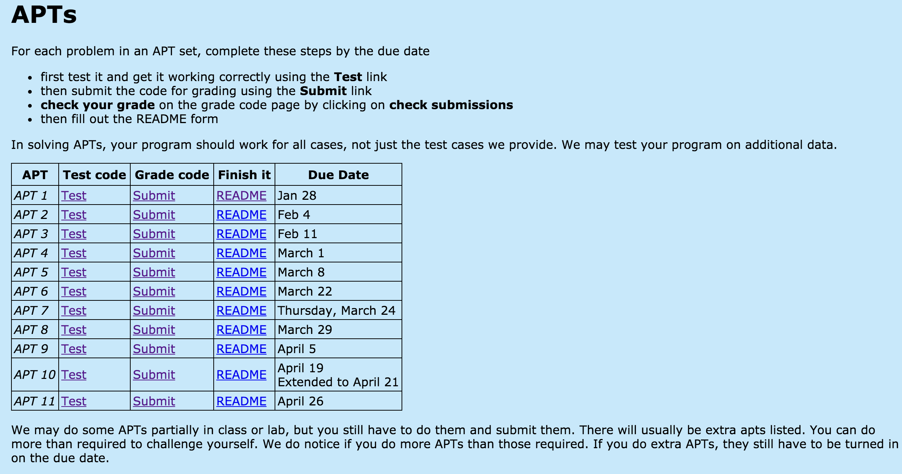
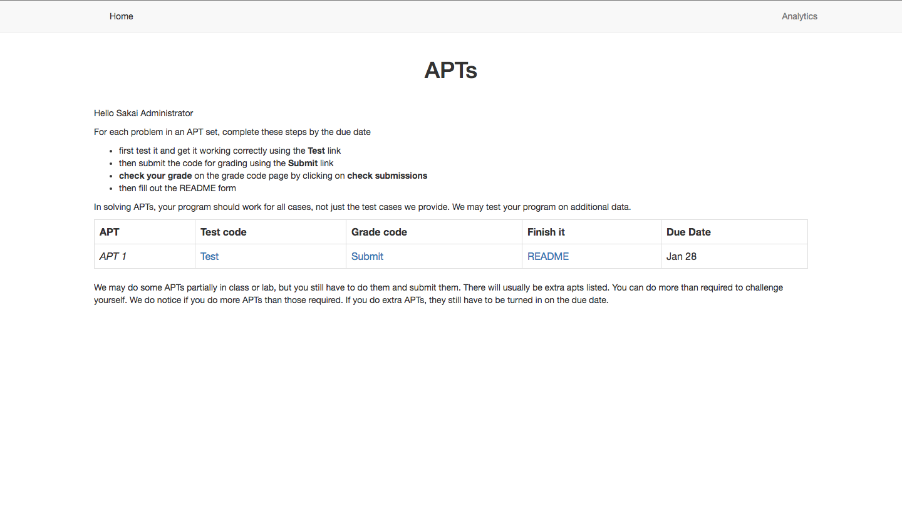
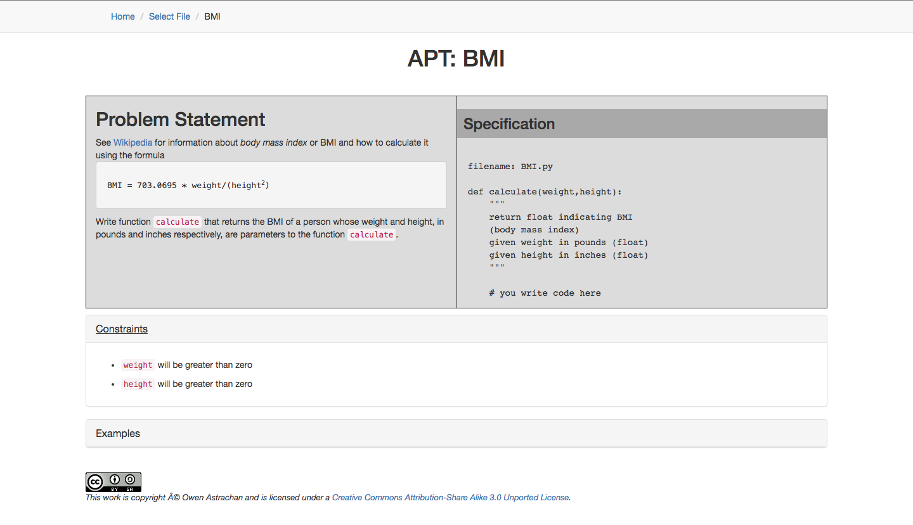
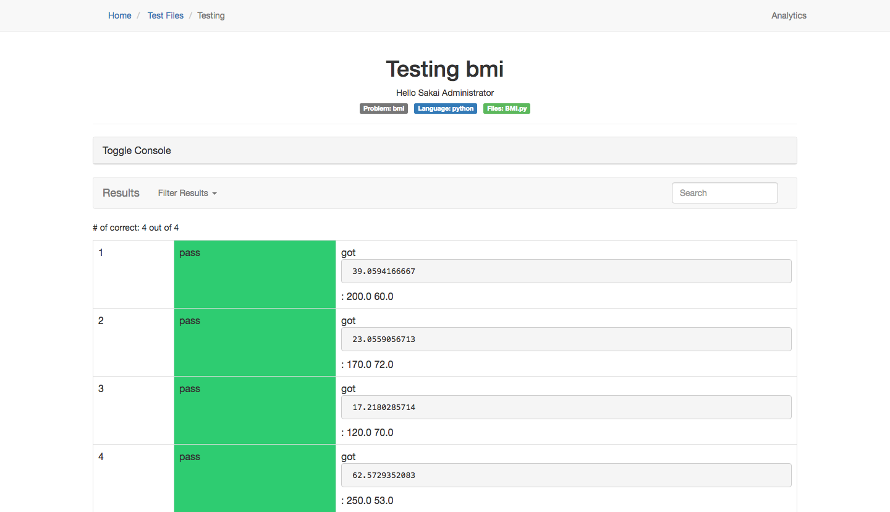

# Integrating Tsugi into the Duke APT System

_Zachary Marion, Sean Hudson_

Link to our [presentation](https://docs.google.com/presentation/d/1W-0KVS2EvGjj2fYEPM-U3YFu9IiKAciqSb5T97SQ4tk/edit?usp=sharing)

### Initial Attempts

Our initial attempts to build a Tsugi module were fraught with gaps in knowledge of both PHP and the framework itself. An early version of the autograder (which was almost entirely dismantled) parsed HTML inputted as text, found where the grade was in the text using regular expressions, and sent the grade to the Sakai gradebook over LTI. This last concept requires a bit more explanation, which will be discussed later on.


While creating this module was helpful in gaining an understanding of LTI and Tsugi's API, it really had very little functionality, and inputting the generated HTML file from the APT autograder itself required a "copy-paste" step that wasn't really any better than a TA copying and pasting the result from the results log into the gradebook. For this reason we decided to integrate Tsugi into Duke's existing APT grading system, which is essentially a handful of php files with a python script for testing the inputted file and generating the appropriate HTML output.

### Second Iteration - Make it pretty

Before receiving the APT code we had scheduled a Skype call with Dr. Charles Severance, the creator of Tsugi and an expert on LTI and LMS's. He was the one who had suggested integrating Tsugi into the existing APT code, and even created an example [github repo](https://github.com/csev/tsugi-php-standalone.git) showing how it could be done. He was quickly willing to meet again after we had received the code, and even implemented the basic LTI functionality to get us started on the project. Our experiences with Dr. Chuck (as he calls himself) have been extremely positive - his passion about LTI is infectious, and had us grinning when we saw a grade being passed from the external tool into Sakai.

After this basic integration had been completed, the first thing we noticed - or rather remembered - was how archaic looking the APT interface was. It seemed well worth the time to upgrade the appearance of the site and add some useful features while we were at it.



The first thing we did - as any self-respecting web developer would do - was [Bootstrap](http://getbootstrap.com/) the hell out of all of the pages. For barely any changes in the HTML you get a much better looking page:





Note that a navigation bar with breadcrumbs was added to make navigation between different pages easier. Additionally, the constraints and examples are now accordion panels, making it easy to hide pieces of information that you don't need to see. In general our goal with the UI overall was to declutter the experience while improving the usability and adding features.

As a bonus adding bootstrap made the site responsive out of the box, so viewing it on mobile (although admittedly with limited functionality) is a much more enjoyable experience.

### The grading page

Most of the time the student spends on the APT system is spend in the `pythonupload.php` file. This is the file that actually runs the grading script and outputs the results. This is also the file where the most changes were made. The main changes are outlined below:

##### Removing the unnecessary table rows

The table rows at the top of the table with no information other than the color (whether the test passed or failed), really have not real use, as they are repeated directly below in the same amount of vertical space but with more information (what the expected result was, etc). For this reason we decided to remove these rows altogether, editing the `Tester.py` file which actually produces the table HTML.

##### Adding search to the results table

Because there are often many results, and perhaps there is only one test that you want to check, you can search through all of the rows of the table. This is done through a toolbar that also contains the filter options (discussed below).

##### Ability to filter results

The ability to filter results was also added, so that the student can choose to only look at the results that he/she passed or failed. This would be quite helpful if there were only a handful of cases not being passed - instead of having to wade through a sea of green the student could simply view only the failed cases.

##### Ability to toggle the PHP logging statements

As these logs are really only useful when the grading fails (which happens quite rarely), by default they are hidden in a panel which can be expanded as needed.

The final version is shown below (not a few other tweaks like having the problem name, language, and file name appear in labels below the title).



### Analytics

While neither of us had really worked with SQL before, we wanted to perform some kind of analytics on the APT data - although the idea was a bit vague at the beginning. Originally we had wanted to store data on each individual case (for example seeing which case was missed the most), but this turned out to be prohibitively time consuming, and so we decided to focus on two metrics - grades received and number of attempts. The number of attempts data was thought to be useful as a greater number of average trials for a particular problem would show not just how the students did on it, but also how long it took them. Given these two measures, a table was created in Tsugi using a `database.php` file (which Tsugi automatically knows to read). This file essentially creates the table, where each row is an LTI user (none of this is used without LTI) and there is a column for the number of trials and highest grade for each of the students.

The analytics page itself is only available if the LTI user logged in is an administrator - something Tsugi keeps track of for you. On this page we display all the data we have on all the users currently enrolled in the course as the default view. From a dropdown you can also select to just view that averages for each of the problems, or a nested pie chart that allows you to compare the average grade vs. the average attempts. This could be a more helpful measure or problem difficulty than just the average grade, as there is no limit on the amount of times a student can test their code. Lastly viewing the raw json data used to generate the graphs (made using [Chart.js](http://www.chartjs.org/) in javascript) is also an option, in case more complex data analysis is required.

Opening the analytics page:


It is important to note that all of this was made possible through Tsugi - Tsugi is was handles the incoming LTI post information and creates a session with the user data. From here, using a Tsugi function in the PDOX helper class, we can call the necessary SQL to update the tables:

```php
// grade to pass to server/sakai
$gradetosend = $perc+0.0;
// column entry in table
$grade_entry = $problem . "_grade";
$attept_entry = $problem . "_attempts";

$PDOX->queryDie("INSERT INTO {$p}apt_grader
    (display_name, link_id, user_id, {$attept_entry}, {$grade_entry})
    VALUES ( :DNAME, :LI, :UI, :COUNT, :GRADE)
    ON DUPLICATE KEY UPDATE display_name=:DNAME, {$attept_entry}=:COUNT,
    {$grade_entry} = CASE WHEN {$grade_entry} < :GRADE THEN :GRADE ELSE {$grade_entry} END
    ",
    array(
        ':DNAME' => $displayname,
        ':LI' => $LINK->id,
        ':UI' => $USER->id,
        ':COUNT' => $runs,
        ':GRADE' => $gradetosend
    )
);
```

### Limitations of LTI

Rather alarmingly late in the process we realized a serious flaw in our initial approach to integrating LTI into the APT grader. The LTI system can only pass **one** grade back to the gradebook per session created. Essentially only one APT could be submitted per session (although any of them could be tested regardless). To handle this we essentially hold all of the grade data on the server, only submitting back the average of the APT's the have been submitted.

### What we accomplished / What could have gone better

In all we believe we have significantly revamped the APT system by providing a more pleasing and functional interface for students to test their code. While sending one grade per session is not ideal, as a proof of concept it shows that LTI can be a powerful way of automating the grading of assignments, one that provides a way to easily extend the functionality of the LMS being used. While Sakai was the focus of our project as it is the LMS that Duke uses, this application should be fully compatible with just about any other LMS supporting LTI (Canvas, Blackboard, etc). This alone is a reason to consider integrating LTI in the future into more of Duke's external tools, especially as the spec continues to evolve and improve.

In reflection, and as it goes with most projects, we would have benefitted from beginning actually coding earlier, rather than researching and attempting to learn PHP (of which only a minimal subset was needed). Additionally, we became quite intent on improving the UI of the APT grader, and only later realized the grading limitation (something that would have been helpful to know from day 1). Despite this, however, we believe the project went quite smoothly, and found the process to be enjoyable and informative. We look forward to seeing how Tsugi and LTI evolve as Learning Management Systems like Sakai continue to improve.
